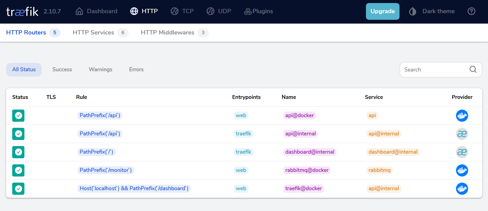
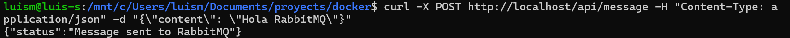
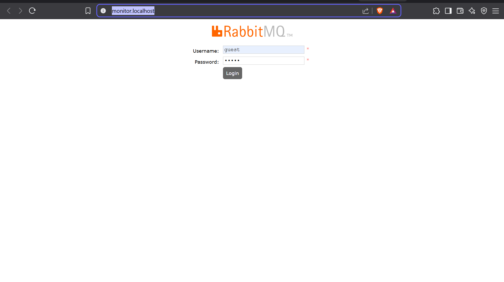

# Parcial 2 Corte

## 1.1 RabbitMQ

### ¿Qué es RabbitMQ y cuándo se debe utilizar una cola frente a un exchange tipo fanout?

RabbitMQ es un servicio que permite gestionar solicitudes mediante colas, evitando que el sistema se colapse cuando recibe más solicitudes de las que puede gestionar concurrentemente.

- **Cola:** Se utiliza cuando el mensaje solo debe ser consumido por un sistema.
- **Exchange tipo fanout:** Se usa cuando el mensaje debe replicarse y ser consumido por varios sistemas (varias colas vinculadas).

---

### ¿Qué es una Dead Letter Queue (DLQ) y cómo se configura en RabbitMQ?

Una **Dead Letter Queue (DLQ)** es una cola especial que almacena mensajes que no pudieron procesarse correctamente.

- **Configuración:**  
  Se configura en RabbitMQ agregando la propiedad de DLX (Dead Letter Exchange) a la cola original.  
  En Docker Compose, asegúrate de tener un volumen persistente para no perder mensajes:
  ```yaml
  volumes:
    - rabbitmq_data:/var/lib/rabbitmq
  ```

---

## 1.2 Docker y Docker Compose

### Diferencia entre un volumen y un bind mount

- **Volumen:**  
  Almacenamiento gestionado por Docker, ubicado en `/var/lib/docker/volumes`.  
  Ejemplo:
  ```yaml
  volumes:
    - myvolume:/data
  ```

- **Bind mount:**  
  Enlaza una carpeta del host directamente al contenedor.  
  Ejemplo:
  ```yaml
  volumes:
    - ./proyecto:/app
  ```

---

### ¿Qué implica usar `network_mode: host` en un contenedor?

Usar `network_mode: host` significa que el contenedor comparte la red del host, usando la misma IP y puertos.  
No se crea una red virtual aislada para el contenedor.

---

## 1.3 Traefik

### Función de Traefik en una arquitectura de microservicios

La función principal de **Traefik** es enrutar las peticiones HTTP/HTTPS entrantes hacia los microservicios correspondientes, actuando como reverse proxy y balanceador de carga.

---

### ¿Cómo asegurar un endpoint usando certificados TLS automáticos en Traefik?

Ejemplo de configuración para Let's Encrypt:

```yaml
command:
  - "--certificatesresolvers.letsencrypt.acme.httpchallenge=true"
  - "--certificatesresolvers.letsencrypt.acme.httpchallenge.entrypoint=web"
  - "--certificatesresolvers.letsencrypt.acme.email=tu_correo@dominio.com"
  - "--certificatesresolvers.letsencrypt.acme.storage=/letsencrypt/acme.json"
```

---

## Proyecto

Este proyecto implementa un sistema de mensajería distribuido utilizando:

- **RabbitMQ:** Broker de mensajes con interfaz de gestión.
- **API Flask:** Servicio para enviar mensajes a la cola.
- **Worker:** Procesa los mensajes de la cola y los guarda en un log.
- **Traefik:** Reverse proxy con dashboard de monitoreo.

---

## Configuración y Uso

### Ejecutar el proyecto

```sh
docker-compose up -d
```

---

### Endpoints

- **API:**  
  - `POST /api/message`  
    Body:  
    ```json
    {"content": "tu mensaje aquí"}
    ```
  - `GET /api/health`  
    Health check de la API.

- **RabbitMQ Management:**  
  - [http://localhost/monitor](http://localhost/monitor)  
    Usuario: `guest`  
    Contraseña: `guest`

- **Traefik Dashboard:**  
  - [http://localhost:8080/dashboard/](http://localhost:8080/dashboard/)  
    (Solo accesible localmente)



---


### Ejemplo: Enviar un mensaje

```sh
curl -X POST -H "Content-Type: application/json" -d '{"content":"Hola mundo"}' http://localhost/api/message
```



---

### Volúmenes

- `rabbitmq-data:` Datos persistentes de RabbitMQ
- `api-logs:` Logs de la API
- `worker-data:` Logs de mensajes procesados por el worker

---

### Variables de Entorno

- `RABBITMQ_HOST`: Dirección del servidor RabbitMQ (por defecto: `rabbitmq`)
- `RABBITMQ_QUEUE`: Nombre de la cola (por defecto: `messages`)

---

### Monitorización

- **RabbitMQ:**  
  [http://monitor.localhost/](http://monitor.localhost/)  
  Usuario: `guest` | Contraseña: `guest`

- **Traefik Dashboard:**  
  [http://localhost:8080/dashboard/](http://localhost:8080/dashboard/)

---
